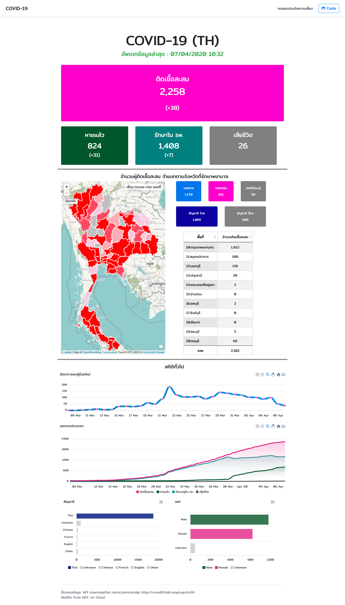

# covid-19-th

* ติดตามสถานการณ์โรคติดเชื้อโคโรนา 2019 (COVID-19) ผ่านหน้าเว็บ
* ทั้งนี้แหล่งที่มาของข้อมูลใช้จาก API ของกรมควบคุมโรค แบบ Real-Time
* รายงาน covid-19 ประจำวัน https://data.go.th/dataset/covid-19-daily

## changelog
* 07/4/63
  * เพิ่ม chart
    * แยกเพศ
    * แยกสัญชาติ
* 05/04/63
  * แสดงยอดประจำวัน
  * แผนที่ผู้ติดเชื้อ
  * ข้อมูลรายจังหวัด
  * แบบประเมินความเสี่ยงผู้ติดเชื้อ
  * chart
    * อัตราการพบผู้ป่วยใหม่
    * สถิติแยกตามช่วงเวลา

## หน้าตา

##
* หากพบข้อผิดพลาดหรือช่องโหว่ความปลอดภัย (Programming bug & Security Vulnerabilities) หรือคุณสมบัติอื่น ๆ ที่อยากเพิ่มเติมในอนาคต สามารถแจ้งมาให้ได้ที่ GitHub Issues -> https://github.com/chiipzaa/covid-19-th/issues